# مزاد فلسطين - Mzad Palestine Database Schema

## Entity Relationship Diagram

```mermaid
erDiagram
    %% Main entities
    User {
        int Id PK
        string FirstName
        string LastName
        string Email
        string Phone
        string Address
        datetime DateOfBirth
        string Bio
        string ProfilePicture
        bool IsActive
        enum UserRole
        bool IsVerified
        int ReputationScore
        datetime CreatedAt
    }

    Listing {
        int ListingId PK
        string Title
        string Description
        decimal Price
        decimal StartingPrice
        int CategoryId FK
        int UserId FK
        enum ListingStatus
        datetime CreatedAt
        datetime UpdatedAt
        datetime EndDate
        bool IsActive
        bool IsSold
    }

    Auction {
        int AuctionId PK
        int ListingId FK
        int UserId FK
        int WinnerId FK
        decimal ReservePrice
        decimal CurrentBid
        decimal BidIncrement
        datetime StartTime
        datetime EndTime
        enum AuctionStatus
        bool IsActive
        datetime CreatedAt
        datetime UpdatedAt
    }

    Bid {
        int BidId PK
        int AuctionId FK
        int UserId FK
        decimal BidAmount
        datetime BidTime
        bool IsAutoBid
    }

    AutoBid {
        int AutoBidId PK
        int AuctionId FK
        int UserId FK
        decimal MaxBid
        decimal CurrentBid
        bool IsActive
    }

    Category {
        int Id PK
        string Name
        string Description
        string ImageUrl
        int ParentCategoryId FK
    }

    Payment {
        int PaymentId PK
        int UserId FK
        int AuctionId FK
        decimal Amount
        string Method
        string Status
        string TransactionId
        string Notes
        datetime CreatedAt
        datetime UpdatedAt
    }

    Invoice {
        int InvoiceId PK
        int UserId FK
        int ListingId FK
        string InvoiceNumber
        decimal Amount
        enum InvoiceStatus
        datetime IssuedAt
        datetime DueDate
        datetime PaidAt
    }

    Review {
        int Id PK
        int ReviewerId FK
        int ReviewedUserId FK
        int ListingId FK
        int Rating
        string Comment
        datetime CreatedAt
    }

    Report {
        int ReportId PK
        int ReporterId FK
        int ReportedListingId FK
        int ResolvedBy FK
        string Reason
        int StatusId
        datetime CreatedAt
        datetime ResolvedAt
        string Resolution
    }

    Message {
        int MessageId PK
        int SenderId FK
        int ReceiverId FK
        string Subject
        string Content
        bool IsRead
        datetime Timestamp
    }

    Notification {
        int NotificationId PK
        int UserId FK
        string Title
        string Content
        bool IsRead
        enum NotificationType
        datetime CreatedAt
    }

    Dispute {
        int DisputeId PK
        int UserId FK
        int AuctionId FK
        int ResolvedBy FK
        string Reason
        enum DisputeStatus
        datetime CreatedAt
        datetime ResolvedAt
        string Resolution
    }

    Tag {
        int TagId PK
        string Name
        string Description
    }

    ListingTag {
        int ListingId PK,FK
        int TagId PK,FK
    }

    Watchlist {
        int WatchlistId PK
        int UserId FK
        int ListingId FK
        datetime AddedAt
    }

    Subscription {
        int SubscriptionId PK
        int UserId FK
        string Plan
        datetime StartDate
        datetime EndDate
        bool IsActive
        decimal Amount
    }

    CustomerSupportTicket {
        int TicketId PK
        int UserId FK
        string Subject
        string Description
        enum TicketStatus
        datetime CreatedAt
        datetime UpdatedAt
    }

    Transaction {
        int TransactionId PK
        int UserId FK
        decimal Amount
        string Description
        enum TransactionType
        datetime TransactionDate
    }

    ListingImage {
        int ImageId PK
        int ListingId FK
        string ImageUrl
        bool IsPrimary
    }

    %% Relationships
    User ||--o{ Listing : "creates"
    User ||--o{ Bid : "places"
    User ||--o{ Payment : "makes"
    User ||--o{ Invoice : "receives"
    User ||--o{ Message : "sends"
    User ||--o{ Message : "receives"
    User ||--o{ Review : "gives"
    User ||--o{ Review : "receives"
    User ||--o{ Report : "makes"
    User ||--o{ Notification : "receives"
    User ||--o{ AutoBid : "sets"
    User ||--o{ Dispute : "raises"
    User ||--o{ Watchlist : "maintains"
    User ||--o{ Subscription : "subscribes"
    User ||--o{ CustomerSupportTicket : "creates"
    User ||--o{ Transaction : "has"
    
    Category ||--o{ Listing : "contains"
    Category ||--o{ Category : "has subcategories"
    
    Listing ||--|| Auction : "has"
    Listing ||--o{ Review : "receives"
    Listing ||--o{ Report : "may have"
    Listing ||--o{ ListingImage : "has"
    Listing ||--o{ Invoice : "generates"
    Listing ||--o{ ListingTag : "has"
    Listing ||--o{ Watchlist : "included in"
    
    Auction ||--o{ Bid : "receives"
    Auction ||--o{ Payment : "generates"
    Auction ||--o{ AutoBid : "has"
    Auction ||--o{ Dispute : "may have"
    
    Tag ||--o{ ListingTag : "used in"
```

## Table Relationship Details

### User Relationships
- User creates many Listings (one-to-many)
- User places many Bids (one-to-many)
- User makes many Payments (one-to-many)
- User receives many Invoices (one-to-many)
- User sends and receives many Messages (one-to-many)
- User gives and receives many Reviews (one-to-many)
- User makes many Reports (one-to-many)
- User receives many Notifications (one-to-many)
- User sets many AutoBids (one-to-many)
- User raises many Disputes (one-to-many)
- User has many Watchlists (one-to-many)
- User has many Subscriptions (one-to-many)
- User creates many CustomerSupportTickets (one-to-many)
- User has many Transactions (one-to-many)

### Category Relationships
- Category contains many Listings (one-to-many)
- Category has many subcategories (self-referencing one-to-many)

### Listing Relationships
- Listing has one Auction (one-to-one)
- Listing receives many Reviews (one-to-many)
- Listing may have many Reports (one-to-many)
- Listing has many Images (one-to-many)
- Listing generates many Invoices (one-to-many)
- Listing has many ListingTags (many-to-many with Tag through ListingTag)
- Listing included in many Watchlists (one-to-many)

### Auction Relationships
- Auction receives many Bids (one-to-many)
- Auction generates many Payments (one-to-many)
- Auction has many AutoBids (one-to-many)
- Auction may have many Disputes (one-to-many)

### Machine Learning Models
The system also includes ML models for price prediction:
- CarPredictionModel: For predicting car prices based on various car attributes
- Mobile price prediction model: For predicting mobile phone prices based on specifications

## Key Database Design Decisions
1. **Identity Framework**: Using ASP.NET Core Identity for user authentication and management
2. **Soft Delete**: Many entities support "IsActive" flag for soft deletion instead of hard deletion
3. **Timestamps**: Most entities track creation and update timestamps
4. **Self-referencing Relationships**: Category has self-referencing relationship for parent-child categories
5. **Composite Keys**: Used for many-to-many relationships like ListingTag
6. **Status Enums**: Entities use status enums to track their current state
7. **On Delete Behavior**: Various delete behaviors (Cascade, Restrict, NoAction) based on business rules
8. **Audit Trails**: Support for tracking who resolved reports, disputes, etc. 