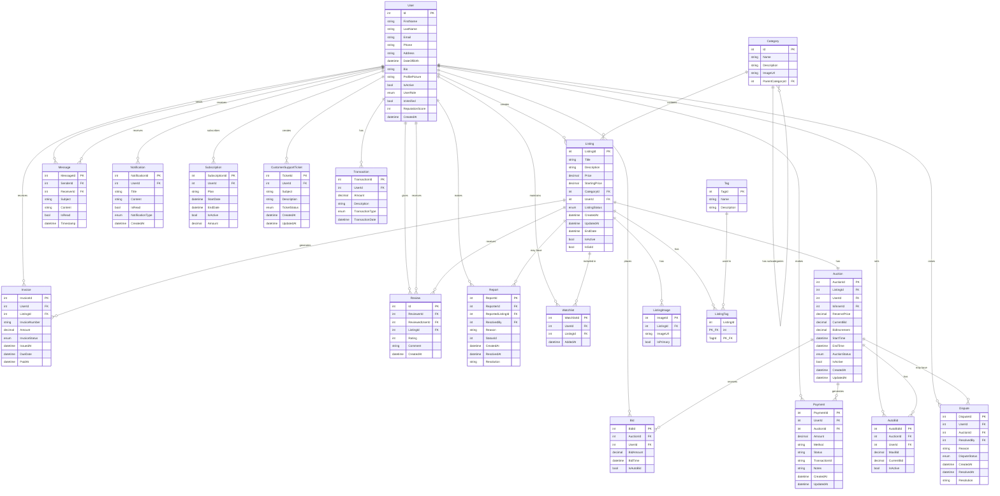

# مخطط قاعدة بيانات مزاد فلسطين

```mermaid
erDiagram
    User ||--o{ Listing : creates
    User ||--o{ Bid : places
    User ||--o{ Payment : makes
    User ||--o{ Invoice : receives
    User ||--o{ Message : sends
    User ||--o{ Message : receives
    User ||--o{ Review : gives
    User ||--o{ Review : receives
    User ||--o{ Report : makes
    User ||--o{ Notification : receives
    User ||--o{ AutoBid : sets
    User ||--o{ Dispute : raises
    User ||--o{ Watchlist : maintains
    User ||--o{ Subscription : subscribes
    User ||--o{ CustomerSupportTicket : creates
    User ||--o{ Transaction : has
    
    Category ||--o{ Listing : contains
    Category ||--o{ Category : "has subcategories"
    
    Listing ||--|| Auction : has
    Listing ||--o{ Review : receives
    Listing ||--o{ Report : "may have"
    Listing ||--o{ ListingImage : has
    Listing ||--o{ Invoice : generates
    Listing ||--o{ ListingTag : has
    Listing ||--o{ Watchlist : "included in"
    
    Auction ||--o{ Bid : receives
    Auction ||--o{ Payment : generates
    Auction ||--o{ AutoBid : has
    Auction ||--o{ Dispute : "may have"
    
    Tag ||--o{ ListingTag : "used in"

    User {
        int Id PK
        string FirstName
        string LastName
        string Email
        string Phone
        string Address
        datetime DateOfBirth
        string Bio
        string ProfilePicture
        bool IsActive
        enum UserRole
        bool IsVerified
        int ReputationScore
        datetime CreatedAt
    }

    Listing {
        int ListingId PK
        string Title
        string Description
        decimal Price
        decimal StartingPrice
        int CategoryId FK
        int UserId FK
        enum ListingStatus
        datetime CreatedAt
        datetime UpdatedAt
        datetime EndDate
        bool IsActive
        bool IsSold
    }

    Auction {
        int AuctionId PK
        int ListingId FK
        int UserId FK
        int WinnerId FK
        decimal ReservePrice
        decimal CurrentBid
        decimal BidIncrement
        datetime StartTime
        datetime EndTime
        enum AuctionStatus
        bool IsActive
        datetime CreatedAt
        datetime UpdatedAt
    }

    Bid {
        int BidId PK
        int AuctionId FK
        int UserId FK
        decimal BidAmount
        datetime BidTime
        bool IsAutoBid
    }

    AutoBid {
        int AutoBidId PK
        int AuctionId FK
        int UserId FK
        decimal MaxBid
        decimal CurrentBid
        bool IsActive
    }

    Category {
        int Id PK
        string Name
        string Description
        string ImageUrl
        int ParentCategoryId FK
    }

    Payment {
        int PaymentId PK
        int UserId FK
        int AuctionId FK
        decimal Amount
        string Method
        string Status
        string TransactionId
        string Notes
        datetime CreatedAt
        datetime UpdatedAt
    }

    Invoice {
        int InvoiceId PK
        int UserId FK
        int ListingId FK
        string InvoiceNumber
        decimal Amount
        enum InvoiceStatus
        datetime IssuedAt
        datetime DueDate
        datetime PaidAt
    }

    Review {
        int Id PK
        int ReviewerId FK
        int ReviewedUserId FK
        int ListingId FK
        int Rating
        string Comment
        datetime CreatedAt
    }

    Report {
        int ReportId PK
        int ReporterId FK
        int ReportedListingId FK
        int ResolvedBy FK
        string Reason
        int StatusId
        datetime CreatedAt
        datetime ResolvedAt
        string Resolution
    }

    Message {
        int MessageId PK
        int SenderId FK
        int ReceiverId FK
        string Subject
        string Content
        bool IsRead
        datetime Timestamp
    }

    Notification {
        int NotificationId PK
        int UserId FK
        string Title
        string Content
        bool IsRead
        enum NotificationType
        datetime CreatedAt
    }

    Dispute {
        int DisputeId PK
        int UserId FK
        int AuctionId FK
        int ResolvedBy FK
        string Reason
        enum DisputeStatus
        datetime CreatedAt
        datetime ResolvedAt
        string Resolution
    }

    Tag {
        int TagId PK
        string Name
        string Description
    }

    ListingTag {
        int ListingId PK_FK
        int TagId PK_FK
    }

    Watchlist {
        int WatchlistId PK
        int UserId FK
        int ListingId FK
        datetime AddedAt
    }

    Subscription {
        int SubscriptionId PK
        int UserId FK
        string Plan
        datetime StartDate
        datetime EndDate
        bool IsActive
        decimal Amount
    }

    CustomerSupportTicket {
        int TicketId PK
        int UserId FK
        string Subject
        string Description
        enum TicketStatus
        datetime CreatedAt
        datetime UpdatedAt
    }

    Transaction {
        int TransactionId PK
        int UserId FK
        decimal Amount
        string Description
        enum TransactionType
        datetime TransactionDate
    }

    ListingImage {
        int ImageId PK
        int ListingId FK
        string ImageUrl
        bool IsPrimary
    }
``` 